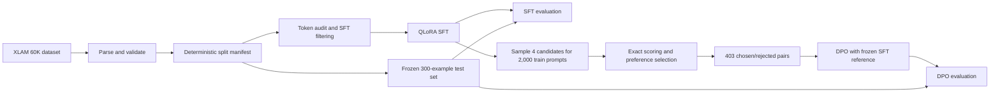

# Tool-Calling QLoRA + DPO

An end-to-end local alignment pipeline that fine-tunes
[`Qwen/Qwen2.5-3B-Instruct`](https://huggingface.co/Qwen/Qwen2.5-3B-Instruct)
for strict JSON tool calling with QLoRA supervised fine-tuning (SFT), then applies
Direct Preference Optimization (DPO) to targeted residual errors.

The project was designed around a practical constraint: train, evaluate, checkpoint,
and recover a 3B-parameter model on a Windows laptop with a 6 GB NVIDIA GPU without
weakening reproducibility or evaluation discipline.

## Results

All reported evaluation stages use the same deterministic, frozen 300-example test
split. Generation uses greedy decoding with `max_new_tokens=384`.

| Stage | JSON valid | Schema valid | Call count | Tool correct | Arguments exact | End-to-end exact |
| --- | ---: | ---: | ---: | ---: | ---: | ---: |
| Base Qwen2.5-3B-Instruct | 93.00% | 88.67% | 84.00% | 83.33% | 50.33% | 50.33% (151/300) |
| SFT pilot, 1,024 records | 99.67% | 99.67% | 97.67% | 97.00% | 70.67% | 70.67% (212/300) |
| Full QLoRA SFT | 100.00% | 100.00% | 98.67% | 97.67% | 82.33% | 82.33% (247/300) |
| SFT + DPO | 100.00% | 100.00% | 98.67% | 98.00% | 82.67% | **82.67% (248/300)** |

The main improvement came from SFT: end-to-end exact accuracy increased by 32.00
percentage points over the base model while malformed output was eliminated on the
test split. DPO made a deliberately small adjustment: five predictions changed, two
errors became exact, one exact prediction regressed, and the net gain was one example.

That DPO result is reported as a modest positive result, not a broad performance claim.
The SFT and DPO bootstrap intervals overlap on this 300-example test set. The result is
still useful because it demonstrates a complete preference-data and alignment pipeline
while preserving 100% JSON and schema validity.

Measured artifacts:

- [Stage-by-stage metric summary](results/experiment_summary.json)
- [Full SFT evaluation](artifacts/evaluations/sft_full_eval.json)
- [DPO evaluation](results/evaluation_dpo_full.json)
- [DPO dataset report](results/dpo_dataset_report.json)
- [SFT training report](artifacts/training/sft_train_full_report.json)
- [DPO training report](artifacts/training/dpo_train_report.json)
- [Recorded baseline and pilot runs](docs/experiment_log.md)

## Problem Definition

The model receives a user request plus one or more tool schemas. It must return only a
JSON array of tool calls:

```json
[
  {
    "name": "get_weather",
    "arguments": {
      "city": "Sydney"
    }
  }
]
```

A response is end-to-end exact only when it has valid JSON, follows the expected call
schema, selects the correct number and names of tools, and provides exactly the expected
arguments and values.

This makes the task stricter than ordinary text generation. A fluent answer is still
wrong if it adds prose, chooses an adjacent tool, omits an argument, invents an argument,
or changes a value.

## Pipeline



## Dataset and Splits

The source dataset is
[`Salesforce/xlam-function-calling-60k`](https://huggingface.co/datasets/Salesforce/xlam-function-calling-60k).
It contains 60,000 function-calling examples with user instructions, available tools,
and target calls.

The split is deterministic with seed `42`. The full generated manifest is persisted
locally at `data/processed/split_manifest.json`; its version-controlled counts and hashes
are in [`results/split_summary.json`](results/split_summary.json).

| Split | Examples | Purpose |
| --- | ---: | --- |
| Train | 59,200 | SFT and DPO source pool |
| Validation | 500 | Reserved for development checks |
| Test | 300 | Frozen comparison set for every reported stage |

The test ID hash is
`f25b889ef7215a7b94d24f4c3d89e7c313bc6d3917e9d1a11290cad8ec922ea6`.
Using the same ID hash across baseline, SFT, and DPO prevents accidental split drift.

### Token audit

Token lengths were measured after rendering the actual chat template rather than from
raw character counts.

| Statistic | Tokens |
| --- | ---: |
| p50 | 402 |
| p90 | 678 |
| p95 | 784 |
| p99 | 1,005 |
| Maximum | 2,271 |

At the configured 1,024-token training limit, 523 of 60,000 total examples exceeded the
limit. Within the training split, 518 records were excluded rather than silently
truncated, leaving **58,682 SFT records**. This protects the tool schema, user request,
and target call from partial-example corruption.

The analysis can be reproduced in
[`notebooks/01_data_prep_analysis.ipynb`](notebooks/01_data_prep_analysis.ipynb), and its
machine-readable result is stored in [`results/token_audit.json`](results/token_audit.json).

## Design Decisions

### 1. QLoRA for constrained hardware

The base model is loaded in 4-bit precision and only LoRA parameters are trained. LoRA
targets all attention and MLP projection layers:

`q_proj`, `k_proj`, `v_proj`, `o_proj`, `gate_proj`, `up_proj`, and `down_proj`.

This keeps the 3B model trainable on a 6 GB laptop GPU while retaining a standard PEFT
adapter that can be saved and loaded independently of the base model.

### 2. Assistant-only SFT loss

Prompt and tool-schema tokens are masked in the SFT labels. Loss is calculated only on
the assistant's target JSON. The model therefore learns the desired tool call instead of
being rewarded for reproducing input context.

### 3. No silent training truncation

Examples over the sequence limit are excluded during SFT dataset construction. The
collators also validate boundaries explicitly. A damaged target is worse than a smaller,
auditable training set.

### 4. Frozen, hash-addressed evaluation

All stages use the same 300 test IDs, prompt renderer, parser, scorer, and deterministic
decoding settings. Configuration and split hashes are embedded in reports and
checkpoints. Metrics are therefore comparable across model stages.

### 5. Non-throwing structured scoring

The evaluator never lets one malformed generation terminate a run. It converts outputs
into typed tool calls when possible and records a specific failure category otherwise:

- malformed JSON
- invalid call item or arguments
- wrong call count
- wrong tool
- missing or extra argument
- wrong argument value
- exact

This produces actionable error analysis instead of a single aggregate accuracy number.

### 6. Targeted preference data

DPO does not reuse the frozen test set. It deterministically samples 2,000 prompts from
the training split and generates four candidates per prompt from the full SFT adapter.

| DPO data statistic | Count |
| --- | ---: |
| Source prompts | 2,000 |
| Sampled candidates | 8,000 |
| Preference pairs | 403 |
| Prompts skipped because all candidates were exact | 1,597 |
| Over-length candidates | 0 |

For each usable prompt, an exact sampled answer is preferred when available; otherwise
the gold answer is used. Rejected candidates are selected with deterministic,
severity-aware error ranking.

| Rejected-answer category | Pairs |
| --- | ---: |
| Wrong argument value | 239 |
| Missing argument | 79 |
| Extra argument | 63 |
| Wrong call count | 13 |
| Wrong tool | 9 |

This concentrates preference learning on mistakes the SFT model actually makes.

### 7. Explicit native DPO loop

The DPO stage is implemented directly with PyTorch, PEFT, and bitsandbytes. One quantized
base model hosts two adapters:

- a trainable policy initialized from the full SFT adapter
- a frozen reference adapter initialized from the same SFT state

The collator masks prompt tokens, sequence log probabilities are summed only over
completion tokens, and the standard sigmoid DPO objective compares policy and reference
preference margins. This implementation makes adapter switching, masking, checkpoint
state, and memory behavior visible and testable.

### 8. Recovery is part of the system

Long-running generation, SFT, DPO, and evaluation jobs write resumable checkpoints.
Training checkpoints include adapter, optimizer, scheduler, gradient-scaler, RNG, and
position state. Candidate and evaluation checkpoints validate run identity before
resuming. Atomic JSON writes prevent partially written metadata from being accepted.

The DPO run was recovered from optimizer step 15 after OneDrive locked an old checkpoint
during cleanup. Cleanup was changed to retry and then warn without terminating training;
the run resumed and completed all 26 optimizer steps.

## Training Configuration

### Full SFT

| Setting | Value |
| --- | --- |
| Base model | `Qwen/Qwen2.5-3B-Instruct` |
| Quantization | 4-bit |
| LoRA rank / alpha / dropout | `8 / 16 / 0.0` |
| Trainable target layers | Attention and MLP projections |
| Training records | 58,682 |
| Epochs | 1 |
| Micro-batch / accumulation | `1 / 16` |
| Effective batch size | 16 |
| Learning rate | `2e-4` |
| Optimizer | 8-bit AdamW |
| Scheduler / warmup | Cosine / 3% |
| Precision | FP16 |
| Objective | Assistant-only causal LM loss |
| Optimizer steps | 3,668 |
| Runtime | 4,112.61 seconds |
| Reported training loss | 0.001412 |

The very low training loss is not used as the quality claim. Model quality is determined
from the frozen test evaluation.

### DPO

| Setting | Value |
| --- | --- |
| Preference pairs | 403 |
| Beta | `0.1` |
| Epochs | 1 |
| Micro-batch / accumulation | `1 / 16` |
| Learning rate | `5e-6` |
| Optimizer | Paged AdamW 8-bit |
| Scheduler | Cosine with 3% warmup |
| Precision | FP16 |
| Optimizer steps | 26 |
| Runtime | 1,715.53 seconds |
| Mean DPO loss | 0.692935 |

The loss staying close to `ln(2)` is consistent with the observed conservative update:
only five of 300 deterministic test outputs changed.

## Evaluation Metrics

- **JSON valid:** output can be decoded as JSON.
- **Schema valid:** decoded output is a list of valid tool-call objects.
- **Call count correct:** predicted and expected numbers of calls match.
- **Tool correct:** tool names match in order.
- **Arguments exact:** argument objects exactly match expected keys and values.
- **Arguments exact given tool:** argument accuracy conditional on correct tool selection.
- **End-to-end exact:** the complete ordered tool-call list is correct.

The scorer uses structural JSON comparison, so object key ordering and superficial JSON
formatting do not affect correctness.

## Project Structure

```text
configs/
  experiment.yaml              Central experiment configuration
data/processed/
  split_manifest.json          Generated deterministic split IDs and hashes
  train.jsonl                  Parsed training split
  validation.jsonl             Reserved validation split
  test.jsonl                   Frozen test split
  sft_train.jsonl              Length-filtered SFT records
  dpo_pairs.jsonl              Chosen/rejected preference pairs
notebooks/
  01_data_prep_analysis.ipynb  Exploratory data and token-length audit
scripts/
  preflight.py                 Python, CUDA, driver, and environment checks
  prepare_data.py              Dataset parsing and deterministic splitting
  build_sft_dataset.py         Prompt rendering and SFT filtering
  run_model_eval.py            Resumable model generation and scoring
  build_dpo_dataset.py         Candidate sampling and pair construction
  train_sft.py                 QLoRA SFT entry point
  train_dpo.py                 Native DPO entry point
src/tool_calling_lora_dpo/
  data.py                      Parsing, validation, and manifests
  prompting.py                 Shared JSON-only chat prompt
  scoring.py                   Non-throwing structured scorer
  evaluation.py                Metrics, error analysis, and confidence intervals
  sft_dataset.py               Assistant-only SFT records
  sft_training.py              SFT plans and checkpoint validation
  preferences.py               Preference-pair selection policy
  dpo_data.py                  Resumable DPO candidate data pipeline
  dpo_training.py              DPO collator, log probabilities, and loss
tests/                          CPU-safe unit and integration tests
results/
  experiment_summary.json      Version-controlled stage comparison
  split_summary.json           Split counts and hashes without dataset rows
```

## Environment

The recorded runs used:

- Windows
- Python 3.13.15
- NVIDIA GeForce RTX 3050 6GB Laptop GPU
- PyTorch 2.12.1 with CUDA 13.2 wheels
- Transformers 5.5.0
- PEFT 0.20.0
- bitsandbytes 0.50.2
- Accelerate 1.15.0

The core modules and tests are CPU-safe. Model loading, generation, SFT, and DPO require
a CUDA-capable GPU for the provided configuration.

## Setup

Run commands from the repository root in PowerShell:

```powershell
py -3.13 -m venv tool-call
.\tool-call\Scripts\python.exe -m pip install --upgrade pip
.\tool-call\Scripts\python.exe -m pip install -r requirements.txt

$env:PYTHONUTF8 = '1'
$env:HF_HOME = Join-Path $PWD.Path 'data\hf_cache'
$env:HF_HUB_DISABLE_SYMLINKS_WARNING = '1'
$env:TOKENIZERS_PARALLELISM = 'false'
```

Accept the dataset and model terms on Hugging Face, then authenticate locally:

```powershell
.\tool-call\Scripts\hf.exe auth login
```

Tokens are never stored in source code or experiment configuration.

## Verification

```powershell
.\tool-call\Scripts\python.exe scripts\preflight.py
.\tool-call\Scripts\python.exe -m ruff check .
.\tool-call\Scripts\python.exe -m pytest
```

The completed implementation passes **153 tests** covering configuration validation,
dataset parsing, deterministic splits, prompt rendering, structured scoring, SFT data,
evaluation checkpoints, preference selection, DPO collation, and DPO loss.

## Reproduce the Pipeline

### 1. Prepare and audit data

```powershell
.\tool-call\Scripts\python.exe scripts\prepare_data.py --audit-tokens
.\tool-call\Scripts\python.exe scripts\build_sft_dataset.py
```

### 2. Evaluate the base model

```powershell
.\tool-call\Scripts\python.exe scripts\run_model_eval.py --stage baseline
```

### 3. Train full SFT

```powershell
.\tool-call\Scripts\python.exe scripts\train_sft.py `
  --logging-steps 50 `
  --save-steps 250 `
  --output-dir artifacts\models\sft_lora_full `
  --report artifacts\training\sft_train_full_report.json
```

Resume an interrupted run:

```powershell
.\tool-call\Scripts\python.exe scripts\train_sft.py `
  --logging-steps 50 `
  --save-steps 250 `
  --output-dir artifacts\models\sft_lora_full `
  --report artifacts\training\sft_train_full_report.json `
  --resume latest
```

### 4. Evaluate full SFT

```powershell
.\tool-call\Scripts\python.exe scripts\run_model_eval.py `
  --stage sft `
  --adapter-path artifacts\models\sft_lora_full `
  --predictions artifacts\predictions\sft_full_eval.jsonl `
  --evaluation artifacts\evaluations\sft_full_eval.json `
  --checkpoint artifacts\checkpoints\evaluation\sft_full_eval_checkpoint.json
```

### 5. Build DPO preferences

```powershell
.\tool-call\Scripts\python.exe scripts\build_dpo_dataset.py --checkpoint-every 10
```

Candidate generation is resumable. Repeating the same command validates the run identity
and continues from the saved candidate checkpoint.

### 6. Train DPO

```powershell
.\tool-call\Scripts\python.exe scripts\train_dpo.py `
  --logging-steps 1 `
  --save-steps 5
```

Resume from the newest complete DPO checkpoint:

```powershell
.\tool-call\Scripts\python.exe scripts\train_dpo.py `
  --logging-steps 1 `
  --save-steps 5 `
  --resume latest
```

### 7. Evaluate DPO

```powershell
.\tool-call\Scripts\python.exe scripts\run_model_eval.py `
  --stage dpo `
  --adapter-path artifacts\models\dpo_lora `
  --predictions results\predictions_dpo_full.jsonl `
  --evaluation results\evaluation_dpo_full.json `
  --checkpoint artifacts\checkpoints\evaluation\dpo_full.json `
  --checkpoint-every 25
```

## Reproducibility and Artifact Policy

- Seed: `42`
- Central config hash:
  `214ec2c3b912d3056f659478b1108cffe31d931628284073469a921549615ba4`
- Split manifests contain exact example IDs and SHA-256 hashes.
- Evaluation reports contain model, adapter, split, decoding, and run identity metadata.
- Large model weights, raw data, caches, and checkpoints are intentionally ignored by Git.
- Metrics are documented only after a real run produces a report.

The final DPO adapter generated in the recorded run has SHA-256:

```text
1F2DF7F500CEB48D6A845F210773F29D8CB90801F915A0EFD5E74F22FDAAE385
```

## Limitations

- The frozen test set contains 300 examples, so the one-example DPO gain is not
  statistically decisive.
- Results come from one deterministic split and one random seed.
- Exact-match scoring is appropriate for strict API calls but does not measure partial
  semantic usefulness.
- The dataset is a tool-calling benchmark; results do not establish general assistant
  quality or production reliability.
- The adapters were evaluated locally and were not tested for serving throughput,
  concurrency, or out-of-domain tool schemas.
- The DPO dataset contains 403 pairs, and the conservative one-epoch configuration made
  only a small policy change.

## Next Experiments

- Increase hard-negative coverage while preserving train/test isolation.
- Compare DPO beta and learning-rate settings through controlled ablations.
- Repeat training across multiple seeds and report uncertainty over runs.
- Add an external held-out function-calling benchmark.
- Measure merged-adapter inference latency and deployment memory.

## License

Project code is released under the MIT license. The Qwen model and XLAM dataset retain
their respective upstream licenses and terms of use.
